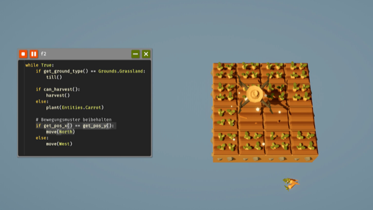

# The Farmer Was Replaced — overengineered 

My save and code for [The Farmer Was Replaced](https://store.steampowered.com/app/2060160/The_Farmer_Was_Replaced/) — a programming game where you take control of a drone and automate a farm by writing Python.



## About This Repo

This repository tracks the contents of my in-game save directory. The game stores everything — code, progress, and unlocked features — as plain files on disk, which makes it a perfect candidate for version control. Committing the save folder lets me:

- Keep a history of how my farm evolved
- Roll back if I break something
- Treat my in-game scripts the way I'd treat any other codebase.. FUN!

## Location

On macOS, the game stores saves at:

```
~/Library/Application Support/com.TheFarmerWasReplaced.TheFarmerWasReplaced/Saves/Save0
```

This repo lives directly inside that folder, so any change made in-game shows up as a working-tree change in git.

## Tooling

Here is the overengineered part, that is completly unecessary but fun to put in place haha. 

The repo is set up with [pre-commit](https://pre-commit.com/) to keep things tidy:

- **black** formats Python files
- **prettier** formats JSON

To enable the hooks after cloning:

```bash
pre-commit install
```

## Disclaimer

This is a personal save. Nothing here is meant to be a guide, tutorial, or reference solution — just a snapshot of my own playthrough.
